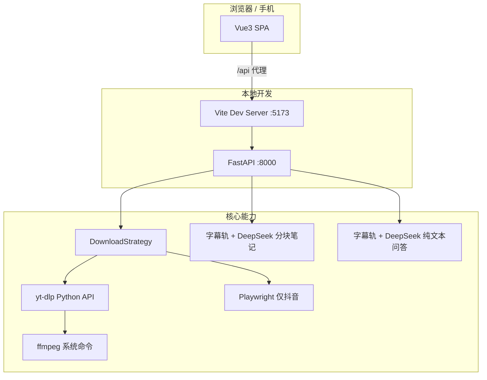

# 技术方案：万能视频下载网站

> 实现细节与 API/UI 契约见 [03-设计文档.md](./03-设计文档.md)。

## 1. 总体架构



- **前后端分离**：生产形态下前端静态资源与 API 可分离部署；开发期 Vite proxy 转发 `/api`。
- **无状态 API（MVP）**：`task_id → 文件路径`、代理 token 可放内存；进程重启即失效，可接受。

## 2. 技术选型

| 组件 | 选型 | 理由 |
|------|------|------|
| 前端 | Vue 3 + Vite + Tailwind CSS | 组件化、HMR、快速搭 UI |
| 后端 | FastAPI + uvicorn | 异步友好、类型与 OpenAPI |
| 下载引擎 | yt-dlp（pip） | YouTube、B 站等多平台 |
| 抖音解析 | Playwright Chromium | 网页接口风控重，无头浏览器抽播放地址 |
| 合并转码 | ffmpeg | yt-dlp 合并 HLS/DASH、音视频分离时的硬依赖 |
| 学习笔记 LLM | DeepSeek Chat Completions | `deepseek-flash`；笔记 JSON Mode；问答纯文本；均关 thinking |
| 存储 | 本地目录 `backend/downloads/` | MVP 无对象存储；TTL 清理 |
| 数据库 | 无 | 降低复杂度 |

## 3. yt-dlp 与抖音分流

**默认（YouTube、B 站等）**

1. **不 fork、不改 yt-dlp 源码**；`services/downloader.py` 封装。
2. **元数据**：`extract_info(url, download=False)` + `sanitize_info()`。
3. **落盘**：`YoutubeDL.download`，`format` 为用户选的 `format_id`；B 站/油管下载请求在 auto 下不再二次 `get_info`。
4. **Cookie**：`cookies.txt` / 浏览器 Cookie / TLS 伪装 **只用于抖音域名** 的 yt-dlp 回退，不带给其他平台。

**抖音（域名 `*.douyin.com` / `iesdouyin.com`）**

1. `services/url_normalize.py` 从分享口令抽链，并把 `modal_id` / `vid` 改写成 `/video/{id}`。
2. `services/douyin_browser.py` 用 Playwright 打开页面，按作品 id 与主播放器取 `douyinvod` 直链（避免推荐流旁边那条）。
3. 下载用 httpx 拉直链；浏览器失败才回退 yt-dlp。
4. Cookie 文件仅作回退，不是主路径。

参考：[yt-dlp Embedding 文档](https://github.com/yt-dlp/yt-dlp#embedding-yt-dlp)

## 4. 双下载模式

### 4.1 模式 A：服务端落盘（`mode: server`）

**流程**

1. 创建 `task_id`，目录 `downloads/{task_id}/`；
2. yt-dlp 下载并可选 ffmpeg 合并（抖音则 httpx 拉已解析直链）；
3. 注册 `task_id → filepath`，设置 `expires_at`；
4. 返回 `GET /api/video/file/{task_id}`；
5. 后台任务或定时器删除过期目录。

**适用**

- HLS/DASH 分片（`m3u8`、`http_dash_segments` 等）；
- 音视频分离需 merge；
- format 无可用 `url`；
- 直链在浏览器侧反复失败。

### 4.2 模式 B：直链（`mode: redirect` | `mode: proxy`）

**B1 重定向**

- 从 format 取 `url`；若平台允许浏览器直接 GET，响应 `redirect_url` 或 API 302。

**B2 代理流**

- 服务端 `httpx`/`requests` 带 `http_headers` 流式转发；
- URL 与 headers 编码进 **短期 signed token**（如 HMAC + 过期时间），路径 `GET /api/video/proxy/{token}`；
- 不占长期磁盘，仍消耗出口带宽。

### 4.3 自动选择（MVP 规则概要）

实现位置：`backend/services/download_strategy.py`

```text
IF prefer_mode == server → server
ELIF prefer_mode == direct → 尝试 redirect/proxy，失败则 server
ELSE auto:  （**当前前端固定传 auto**）
  IF 分片协议 OR 需 merge OR 无 url → server
  ELIF extractor 在 DIRECT_UNRELIABLE 列表 → server（prefer direct 时可为 proxy）
  ELSE IF progressive 单文件有 url → redirect（必要时 proxy）
ON 直链不可用 → 同一请求内 fallback server（响应 `fallback: true`）
```

平台列表与协议集合在 **`backend/config.py`** 中配置。

### 4.4 本地开发注意（server 模式）

前后端同机运行时，server 模式会先写入 `backend/downloads/`，浏览器再通过 `/api/video/file/{task_id}` 保存一份，**硬盘上可能短暂两份**；临时目录约 1 小时 TTL 清理。详见 [04-实现与产品差异.md](./04-实现与产品差异.md)。

## 5. 本地开发与联调

| 进程 | 命令（实现后写在根 README） |
|------|-----------------------------|
| 后端 | `cd backend && uvicorn main:app --reload --port 8000` |
| 前端 | `cd frontend && npm run dev` |

- Vite：`server.proxy['/api'] → http://127.0.0.1:8000`
- FastAPI：`CORSMiddleware` 允许 `http://localhost:5173`（及局域网调试 IP 可选）

## 6. 依赖与环境

**Python（backend/requirements.txt 预期）**

- fastapi, uvicorn, yt-dlp, httpx, pydantic, playwright, curl_cffi, python-dotenv

**系统**

- 可选：ffmpeg 在 PATH 中（合并失败时 API 返回明确错误码与文案）
- 可选：`backend/.env` 中的大模型 Key（学习笔记与问AI）
- Playwright Chromium：`python -m playwright install chromium`（仅抖音需要）

**Node**

- 前端 package.json：vue, vite, tailwindcss；笔记脑图另含 `mind-elixir@5.15.1`、`@zumer/snapdom`（按需加载，见 06）

## 7. 风险与缓解

| 风险 | 缓解 |
|------|------|
| 版权/ToS | 产品文案 + 不提供「破解会员」类能力 |
| 平台反爬 | YouTube/B 站跟 yt-dlp；抖音走无头浏览器；失败信息透传 |
| 抖音抓错片 | 按 aweme id / 主播放器取链，不用推荐流第一条 |
| 磁盘占满 | TTL、单任务大小提示、并发上限 |
| 直链过期 | 短 token；失败回退 server |
| 大模型费用 / Key 泄露 | 本地 `.env`；不提交；无 Key 时大纲/要点/脑图与问AI不可用，字幕仍可；下载不受影响 |

## 8. MVP 交付状态

| 项 | 状态 |
|----|------|
| 脚手架、docs、README、健康检查 | 已完成 |
| info / strategy / server / file / proxy | 已完成 |
| redirect、auto、fallback | 已完成 |
| Vue 产品化 UI、Vite 联调 | 已完成 |
| 单测 strategy / format_list / url_normalize / 平台隔离 | 已完成 |
| 单测字幕解析 / notes summarize / chat / DeepSeek payload | 已完成 |
| AI 学习笔记 | 已完成（分块 API + 四按钮 Tab） |
| 视频问答 | 已完成（`POST /api/notes/chat`；只读字幕轨，无轨失败） |

AI 学习笔记见 [06-AI学习笔记功能总结.md](./06-AI学习笔记功能总结.md)；问答见 [08-AI视频问答功能总结.md](./08-AI视频问答功能总结.md)。下文第 10～11 节只保留管线摘要。

## 9. 修订记录

| 日期 | 摘要 |
|------|------|
| 2026-09-25 | 初版：Vue3 栈、双模式、yt-dlp 封装原则、本地开发 |
| 2026-09-25 | MVP 已实现；补充本地 server 双份说明、前端仅 auto |
| 2026-09-25 | 抖音 Playwright 分流；Cookie 不进入 B 站/油管 |
| 2026-09-25 | 增加 AI 学习笔记：字幕 → LLM → 大纲/要点/脑图 |
| 2026-09-26 | 笔记改为分块 API；方案文档并入 06 功能总结；架构图补笔记 |
| 2026-09-26 | 增加字幕轨问答 `/api/notes/chat` |
| 2026-09-26 | 问答交付总结并入 docs/08 |
| 2026-09-27 | 脑图前端画布：mind-elixir + snapdom；summarize 契约不变 |

## 10. AI 学习笔记

```text
粘贴链接（已解析）
  → POST /api/notes/summarize  { url, part }
  → 拉字幕轨（官方优先，否则自动；跳过弹幕；进程内按 URL 缓存）
  → part=transcript：不调模型
  → part=outline|points|map：DeepSeek JSON Mode，只生成当前块
```

- 配置：`DEEPSEEK_API_KEY`（或 `OPENAI_API_KEY`）；默认 `https://api.deepseek.com`、`deepseek-flash`。
- `response_format.json_object`，`thinking.type=disabled`。大纲/要点/脑图无 Key：`503`。字幕无 Key 仍可。无轨：`400`。模型失败：`502`。
- 实现：`api/notes.py`、`services/captions.py`、`services/llm.py`、`services/notes.py`。

## 11. 解析后问答

```text
粘贴链接（已解析）
  → POST /api/notes/chat  { url, messages }
  → 拉字幕轨（与笔记同一缓存）
  → DeepSeek 纯文本（关 thinking，无 JSON Mode）
  → { reply }
```

- 最后一条必须是 user；最多 16 条、单条 2000 字；历史由前端带上，后端不落库。
- 无 Key：`503`。无字幕：`400`。模型失败：`502`。
- 实现与验收见 [08](./08-AI视频问答功能总结.md)。
