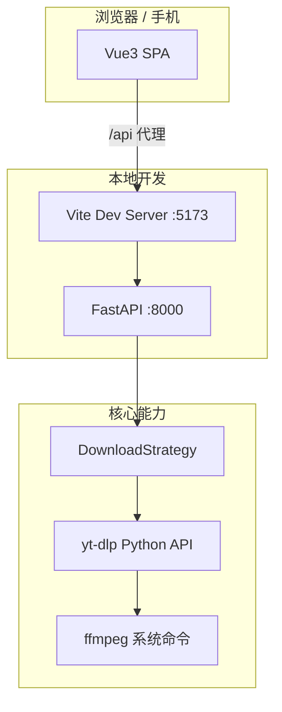

# 技术方案：万能视频下载网站

> 实现细节与 API/UI 契约见 [03-设计文档.md](./03-设计文档.md)。

## 1. 总体架构



- **前后端分离**：生产形态下前端静态资源与 API 可分离部署；开发期 Vite proxy 转发 `/api`。
- **无状态 API（MVP）**：`task_id → 文件路径`、代理 token 可放内存；进程重启即失效，可接受。

## 2. 技术选型

| 组件 | 选型 | 理由 |
|------|------|------|
| 前端 | Vue 3 + Vite + Tailwind CSS | 组件化、HMR、快速搭 UI |
| 后端 | FastAPI + uvicorn | 异步友好、类型与 OpenAPI |
| 下载引擎 | yt-dlp（pip） | 多平台 extractor 成熟，社区活跃 |
| 合并转码 | ffmpeg | yt-dlp 合并 HLS/DASH、音视频分离时的硬依赖 |
| 存储 | 本地目录 `backend/downloads/` | MVP 无对象存储；TTL 清理 |
| 数据库 | 无 | 降低复杂度 |

## 3. yt-dlp 集成原则

1. **不 fork、不改 yt-dlp 源码**；通过 `pip install yt-dlp` 依赖 + 项目内 `services/downloader.py` 封装。
2. **元数据**：`YoutubeDL.extract_info(url, download=False)` + `sanitize_info()`，供前端展示与策略判断。
3. **落盘下载**：`YoutubeDL.download([url])`，`outtmpl` 指向任务专属目录，`format` 为用户选择的 `format_id`。
4. **选项来源**：CLI 参数与 Python `ydl_opts` 对应；复杂平台后续用 `extractor_args` 配置化，不写死魔法值。
5. **安全**：Cookie、敏感 header **仅留在服务端**；直链 redirect 时注意勿把私有 token 长期暴露在前端日志。

参考：[yt-dlp Embedding 文档](https://github.com/yt-dlp/yt-dlp#embedding-yt-dlp)

## 4. 双下载模式

### 4.1 模式 A：服务端落盘（`mode: server`）

**流程**

1. 创建 `task_id`，目录 `downloads/{task_id}/`；
2. yt-dlp 下载并可选 ffmpeg 合并；
3. 注册 `task_id → filepath`，设置 `expires_at`；
4. 返回 `GET /api/video/file/{task_id}`；
5. 后台任务或定时器删除过期目录。

**适用**

- HLS/DASH 分片（`m3u8`、`http_dash_segments` 等）；
- 音视频分离需 merge；
- format 无可用 `url`；
- 直链在浏览器侧反复失败。

### 4.2 模式 B：直链（`mode: redirect` | `mode: proxy`）

**B1 重定向**

- 从 format 取 `url`；若平台允许浏览器直接 GET，响应 `redirect_url` 或 API 302。

**B2 代理流**

- 服务端 `httpx`/`requests` 带 `http_headers` 流式转发；
- URL 与 headers 编码进 **短期 signed token**（如 HMAC + 过期时间），路径 `GET /api/video/proxy/{token}`；
- 不占长期磁盘，仍消耗出口带宽。

### 4.3 自动选择（MVP 规则概要）

实现位置：`backend/services/download_strategy.py`

```text
IF prefer_mode == server → server
ELIF prefer_mode == direct → 尝试 redirect/proxy，失败则 server
ELSE auto:
  IF 分片协议 OR 需 merge OR 无 url → server
  ELIF extractor 在 DIRECT_UNRELIABLE 列表 → server（或 proxy 再 fallback server）
  ELSE IF progressive 单文件有 url → redirect（必要时 proxy）
ON download failure AND mode != server → 重试 server
```

平台列表与协议集合应 **可配置**（如 `config.py` 或 JSON），便于扩展时不改核心逻辑。

## 5. 本地开发与联调

| 进程 | 命令（实现后写在根 README） |
|------|-----------------------------|
| 后端 | `cd backend && uvicorn main:app --reload --port 8000` |
| 前端 | `cd frontend && npm run dev` |

- Vite：`server.proxy['/api'] → http://127.0.0.1:8000`
- FastAPI：`CORSMiddleware` 允许 `http://localhost:5173`（及局域网调试 IP 可选）

## 6. 依赖与环境

**Python（backend/requirements.txt 预期）**

- fastapi, uvicorn, yt-dlp, httpx（代理流）, pydantic 等

**系统**

- ffmpeg 在 PATH 中（合并失败时 API 返回明确错误码与文案）

**Node**

- 前端 package.json：vue, vite, tailwindcss, postcss, autoprefixer 等

## 7. 风险与缓解

| 风险 | 缓解 |
|------|------|
| 版权/ToS | 产品文案 + 不提供「破解会员」类能力 |
| 平台反爬 | 依赖 yt-dlp 更新；失败信息透传；server 回退 |
| 磁盘占满 | TTL、单任务大小提示、并发上限 |
| 直链过期 | 短 token；失败回退 server |
| ffmpeg 缺失 | 启动或下载前检测，友好错误 |

## 8. 分阶段交付（与实现对齐）

| 阶段 | 交付物 |
|------|--------|
| 1 | 目录脚手架、docs、README、健康检查 |
| 2 | `/api/video/info`、strategy、server 下载与 file 路由 |
| 3 | redirect/proxy、auto 与 fallback |
| 4 | Vue 完整页、联调、模式展示 |
| 5 | 多平台冒烟测试清单 |

每阶段结束 **人工验收** 后再进入下一阶段。

## 修订记录

| 日期 | 摘要 |
|------|------|
| 2026-09-25 | 初版：Vue3 栈、双模式、yt-dlp 封装原则、本地开发 |
