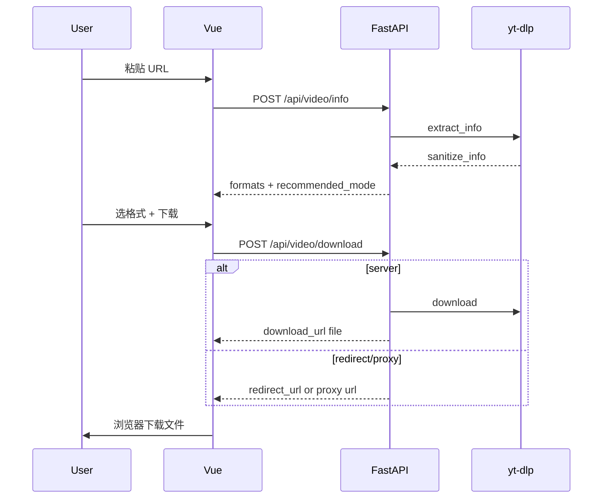

# 设计文档：万能视频下载网站

## 1. UI 设计

### 1.1 参考与调性

- **参考站点**：[https://ai.codefather.cn/painting](https://ai.codefather.cn/painting)
- **调性**：干净、专业、略偏「工具产品」；Hero 强调 **一键 / 万能 / 多平台**；卡片区可用手绘/信息图风格插图（后续资源可补）。

### 1.2 布局结构

```text
┌─────────────────────────────────────┐
│ Nav: Logo + 站点名（无登录）          │
├─────────────────────────────────────┤
│ Hero: 大标题 + 渐变关键词 + 副标题    │
│ [  粘贴视频链接…………………  ] [解析]     │  ← 圆角 pill 搜索框
├─────────────────────────────────────┤
│ 解析结果卡片（有数据时显示）          │
│  封面 | 标题 | 时长 | 平台标签        │
│  推荐方式 Tag + 格式列表 + 下载按钮   │
├─────────────────────────────────────┤
│ 功能卡片网格（双模式 / 多平台 / 版权） │
├─────────────────────────────────────┤
│ Footer: 学习声明 + 链接               │
└─────────────────────────────────────┘
```

### 1.3 视觉 Token（Tailwind 建议）

| Token | 值 / 类名 |
|-------|-----------|
| 页面背景 | `bg-slate-50` / `bg-white` |
| 主渐变 | `bg-gradient-to-r from-indigo-500 to-purple-600` |
| 标题强调 | 渐变文字或 `text-indigo-600` 片段 |
| 卡片 | `rounded-2xl shadow-sm border border-slate-100` |
| 主按钮 | 渐变底 + `rounded-full` 或 `rounded-xl` |
| 断点 | 移动优先；`md:` 双列卡片 |

### 1.4 组件划分（Vue）

| 组件 | 职责 |
|------|------|
| `UrlSearch.vue` | v-model url、解析 loading、emit `parse` |
| `VideoResult.vue` | 展示 info、格式 radio/select、`prefer_mode` 折叠面板、下载 loading |
| `FeatureCards.vue` | 静态卖点与版权提示 |
| `App.vue` | 组合布局、错误条、调用 `api/video.ts` |

### 1.5 交互状态

- **解析中**：按钮 disabled + spinner；
- **下载中**：按 `mode` 分支——server 轮询或等待后打开 file URL；redirect 跳转；proxy 打开 proxy URL；
- **错误**：顶部或结果区 `alert`（红色/琥珀），展示后端 `detail` 或 `message`；
- **推荐模式**：只读 Tag + tooltip/`recommended_reason`。

---

## 2. API 设计

Base URL（开发）：浏览器请求 `/api/...`，由 Vite 代理到 FastAPI。

### 2.1 通用约定

- Content-Type：`application/json`
- 错误：`HTTP 4xx/5xx` + body `{ "detail": "..." }` 或 FastAPI 默认 `detail` 数组
- 未来扩展：可在 header 加 `X-API-Version: 1`

### 2.2 POST `/api/video/info`

**Request**

```json
{ "url": "https://..." }
```

**Response 200**

```json
{
  "title": "string",
  "thumbnail": "string | null",
  "duration": 0,
  "extractor": "string",
  "webpage_url": "string",
  "recommended_mode": "server | redirect | proxy",
  "recommended_reason": "string",
  "formats": [
    {
      "format_id": "string",
      "ext": "mp4",
      "resolution": "1080p",
      "filesize": 0,
      "vcodec": "string | null",
      "acodec": "string | null",
      "protocol": "https | m3u8 | ..."
    }
  ]
}
```

**说明**：`formats` 为后端过滤后的「对用户可选」列表（去重、隐藏无用 test format）。

### 2.3 POST `/api/video/download`

**Request**

```json
{
  "url": "https://...",
  "format_id": "137",
  "prefer_mode": "auto"
}
```

`prefer_mode`: `auto` | `server` | `direct`（`direct` 表示优先 redirect/proxy）

**Response 200（union）**

```json
{
  "mode": "server",
  "filename": "标题.mp4",
  "download_url": "/api/video/file/{task_id}",
  "expires_at": "ISO8601"
}
```

```json
{
  "mode": "redirect",
  "filename": "标题.mp4",
  "redirect_url": "https://..."
}
```

```json
{
  "mode": "proxy",
  "filename": "标题.mp4",
  "download_url": "/api/video/proxy/{token}"
}
```

**失败回退**：若 `auto/direct` 下直链失败，同一请求内重试 server 并返回 `mode: server`（可选响应头 `X-Fallback: server`）。

### 2.4 GET `/api/video/file/{task_id}`

- 成功：`FileResponse`，`Content-Disposition: attachment; filename*=UTF-8''...`
- 404：任务不存在或已过期

### 2.5 GET `/api/video/proxy/{token}`

- 验证 token 签名与过期时间；
- `StreamingResponse`，转发 Range 请求（若实现成本低可 Phase 1.1 再做）；
- 403/410：token 无效或过期

### 2.6 GET `/api/health`

```json
{ "status": "ok", "ffmpeg": true }
```

---

## 3. 后端模块设计

```text
backend/
├── main.py                 # app 工厂、CORS、路由挂载
├── api/video.py            # 路由层，薄
├── models/schemas.py       # Pydantic
├── services/
│   ├── downloader.py       # YoutubeDL 封装：get_info, download_to_dir, pick_format
│   ├── download_strategy.py # choose_mode, DIRECT_UNRELIABLE
│   ├── task_store.py       # 内存 task_id 注册表 + TTL（可替换 Redis）
│   └── proxy_token.py      # 签发/校验 proxy token
└── downloads/              # .gitignore
```

### 3.1 `VideoDownloader`（示意）

```python
class VideoDownloader:
    def get_info(self, url: str) -> dict: ...
    def download(self, url: str, format_id: str, out_dir: Path) -> Path: ...
    def get_format(self, info: dict, format_id: str) -> dict | None: ...
```

### 3.2 `DownloadStrategy`

```python
def recommend_mode(info: dict, format: dict, prefer: str) -> tuple[str, str]:
    """返回 (mode, reason) mode in server|redirect|proxy"""

def execute_download(...) -> DownloadResult:
    """统一入口，内含 fallback"""
```

### 3.3 配置扩展点（建议 `backend/config.py`）

```python
FILE_TTL_SECONDS = 3600
MAX_CONCURRENT_DOWNLOADS = 2
DIRECT_UNRELIABLE_EXTRACTORS = {"youtube", "bilibili", ...}  # 小写 extractor key
FRAGMENT_PROTOCOLS = {"m3u8", "m3u8_native", "http_dash_segments", ...}
```

---

## 4. 前端模块设计

```text
frontend/src/
├── api/video.ts      # info(), download(), types
├── types/video.ts    # VideoInfo, Format, DownloadResponse 联合类型
├── components/       # 见 1.4
├── App.vue
└── main.ts
```

### 4.1 类型与下载分支（伪代码）

```typescript
async function handleDownload() {
  const res = await downloadVideo({ url, format_id, prefer_mode })
  if (res.mode === 'server' || res.mode === 'proxy') {
    window.location.href = res.download_url
  } else if (res.mode === 'redirect') {
    window.location.href = res.redirect_url
  }
}
```

移动端：大按钮、输入框 `font-size` ≥ 16px 避免 iOS 缩放。

---

## 5. 数据流



---

## 6. 后续功能扩展指南（给 AI）

| 功能 | 建议落点 | 注意 |
|------|----------|------|
| 字幕下载 | `downloader.py` 增加 `writesubtitles`；新 API `/api/video/subtitles` | 仍走 server 模式为主 |
| 仅音频 | format 筛选 `acodec != none`；UI 增加「音频」Tab | |
| 播放列表 | info 检测 `_type playlist`；批量 task 队列 | 需并发与进度 UI |
| AI 总结 | 新 `services/summary.py` + 外部 LLM API | 与下载解耦，异步 job |
| 付费 | 新 auth 模块 + DB；**先更新 01-需求分析** | 合规评审 |
| 生产部署 | 对象存储替代本地 disk；token 存 Redis | 更新 02 架构图 |

---

## 7. 测试清单（冒烟）

- [ ] `/api/health` 返回 ffmpeg 状态
- [ ] 合法 URL 解析返回非空 `title` 与 `formats`
- [ ] server 模式：下载后 file 可打开
- [ ] direct 失败时 fallback server
- [ ] 过期 task_id 返回 404
- [ ] 窄屏宽度布局无横向溢出

---

## 修订记录

| 日期 | 摘要 |
|------|------|
| 2026-09-25 | 初版：UI/API/模块/扩展点 |
