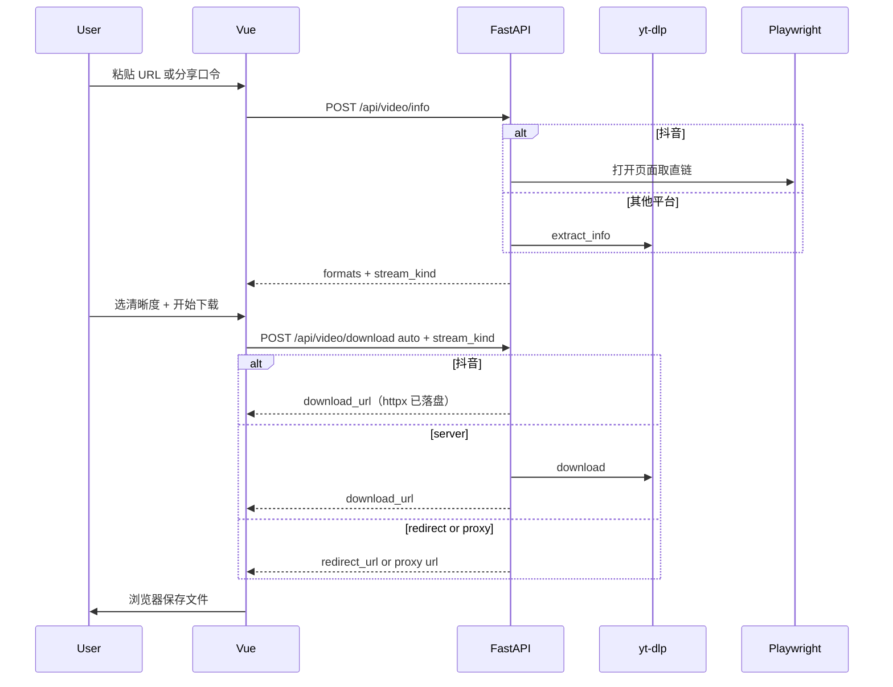

# 设计文档：万能视频下载网站

> 产品与实现差异见 [04-实现与产品差异.md](./04-实现与产品差异.md)。

## 1. UI 设计

### 1.0 设计稿

- 可选维护 [design.pen](./design.pen)；实现以 `frontend/` 与 `tailwind.config.js` 为准。

### 1.1 参考与调性

- **气质参考**：[鱼皮 AI 绘图导航](https://ai.codefather.cn/painting)（居中搜索、卡片、工具产品感）。
- **当前实现**：白/浅灰底、**单色 accent `#2563EB`**、Geist/Inter 标题、柔和背景光斑；文案偏 **「保存到手机/本机」**，少技术术语。

### 1.2 布局结构

```text
┌─────────────────────────────────────┐
│ Nav: Logo + 站点名（无登录）          │
├─────────────────────────────────────┤
│ Hero: 状态化标题 + 副标题             │  ← idle / parsing / ready / downloading / 错误
│ [ 粘贴链接 pill 搜索 ] 或 [已识别|更换] │
├─────────────────────────────────────┤
│ StatusAlert（解析/下载/服务错误）     │
│ ResultSkeleton（解析中）              │
│ VideoResult（封面、平台、清晰度、下载）│
│ HowItWorks 三步（仅未解析时）         │
├─────────────────────────────────────┤
│ Footer: 版权与学习声明                │
└─────────────────────────────────────┘
```

**不在 MVP 界面展示**：`recommended_mode` Tag、自动/强制服务端/优先直链、`FeatureCards` 三卡网格。

### 1.3 视觉 Token（`frontend/tailwind.config.js`）

| Token | 值 / 用途 |
|-------|-----------|
| `surface` | `#F7F8FA` 页面底 |
| `raised` | `#FFFFFF` 卡片/顶栏 |
| `ink` / `muted` | 主文字 / 次要文字 |
| `line` | 边框 `#E2E8F0` |
| `accent` / `accent-soft` | 主色 `#2563EB` / 浅蓝底 |
| `danger-*` / `warn-*` | StatusAlert 色调 |
| `max-w-content` / `max-w-search` | 960px / 720px |
| `font-display` | Geist, Inter… |

### 1.4 组件划分（Vue）

| 组件 | 职责 |
|------|------|
| `UrlSearch.vue` | 搜索条；`type=text`，可粘贴分享口令；emit `parse`、暴露 `focus()` |
| `VideoResult.vue` | 封面/标题/平台标签、清晰度下拉、`prefer_mode: 'auto'` + `stream_kind` 下载 |
| `VideoStudyNotes.vue` | 生成学习笔记、Tab（大纲/要点/脑图/字幕）、复制与导出 |
| `MindMapTree.vue` | 递归展示思维导图 |
| `StatusAlert.vue` | 统一错误/警告条（tone + title + detail） |
| `ResultSkeleton.vue` | 解析等待占位 |
| `HowItWorks.vue` | 首页三步说明（粘贴 → 选清晰度 → 保存） |
| `App.vue` | 状态机 `view`、Hero 文案 COPY、调用 `api/video.js` |

### 1.5 交互状态

- **解析中**：Hero 不变或保持；`ResultSkeleton`；搜索按钮 loading。
- **解析成功**：搜索框变为「已识别 + 更换链接」；展示 `VideoResult`；隐藏 `HowItWorks`。
- **下载中**：主按钮「正在准备下载…」；Hero 切到 downloading 文案；后端完成后 `window.location.href` 触发浏览器保存（server/proxy 用 `download_url`，redirect 用 `redirect_url`）。
- **错误**：`StatusAlert`（解析失败 / 下载失败 / 后端不可用）；下载失败时保留已解析结果，无需重新粘贴链接。
- **清晰度**：下拉展示 `resolution` + `约 size · 含声音|视频+音频合并|仅音频`（来自 `stream_kind`）。

---

## 2. API 设计

Base URL（开发）：浏览器请求 `/api/...`，由 Vite 代理到 FastAPI。

### 2.1 通用约定

- Content-Type：`application/json`
- 错误：`HTTP 4xx/5xx` + body `{ "detail": "..." }` 或 FastAPI 默认 `detail` 数组

### 2.2 POST `/api/video/info`

**Request**

```json
{ "url": "https://..." }
```

**Response 200**

```json
{
  "title": "string",
  "thumbnail": "string | null",
  "duration": 0,
  "extractor": "string",
  "webpage_url": "string",
  "recommended_mode": "server | redirect | proxy",
  "recommended_reason": "string",
  "formats": [
    {
      "format_id": "string",
      "ext": "mp4",
      "resolution": "1080p",
      "filesize": 0,
      "vcodec": "string | null",
      "acodec": "string | null",
      "protocol": "https | m3u8 | ...",
      "stream_kind": "muxed | merge | audio"
    }
  ]
}
```

**说明**

- `formats`：后端 `list_user_formats()` 过滤去重，最多约 40 条。
- `stream_kind`：`muxed` 音画同轨；`merge` 仅视频轨（下载时服务端合并音频）；`audio` 仅音频。
- `recommended_*`：**当前前端不展示**，供日志/后续「换方式重试」使用。

### 2.3 POST `/api/video/download`

**Request**

```json
{
  "url": "https://...",
  "format_id": "137",
  "prefer_mode": "auto",
  "stream_kind": "merge"
}
```

`prefer_mode`: `auto` | `server` | `direct` — **MVP 前端固定 `auto`**。`stream_kind` 可选，前端把当前清晰度类型带上，供 B 站/油管下载时判断是否合并、并跳过第二次解析。

**Response 200（union）**

含 `mode`、`filename`；以及 `download_url` 或 `redirect_url`；server 模式含 `expires_at`。直链失败回退 server 时 `fallback: true`、`reason` 可选 — **前端当前不展示**。

### 2.4 GET `/api/video/file/{task_id}`

- 成功：`FileResponse`，`Content-Disposition: attachment`
- 404：任务不存在或已过期

### 2.5 GET `/api/video/proxy/{token}`

- 短期 HMAC token；`StreamingResponse` 流式转发（Range 未实现）
- 403：token 无效或过期

### 2.6 GET `/api/health`

```json
{ "status": "ok", "ffmpeg": true, "llm": false, "llm_model": null }
```

`llm`：是否已读到 `DEEPSEEK_API_KEY`（或 `OPENAI_API_KEY`）。

### 2.7 POST `/api/video/summarize`

**Request**

```json
{ "url": "https://..." }
```

**Response 200**

含 `title`、`webpage_url`、`language`、`source`（`official` | `auto`）、`overview`、`outline[]`（`start`/`timestamp`/`title`/`summary`）、`key_points[]`、`mind_map`（递归 `label`/`children`）、`transcript[]`、`markdown`。

**错误**

- 503：未配置 DeepSeek Key
- 400：无字幕、抖音、解析失败
- 502：大模型调用失败

笔记不依赖先下载视频。

---

## 3. 后端模块设计

```text
backend/
├── main.py
├── config.py
├── api/video.py              # info / summarize / download / file / proxy
├── models/schemas.py
├── services/
│   ├── downloader.py         # get_info, download, list_user_formats
│   ├── douyin_browser.py     # 仅抖音 Playwright
│   ├── url_normalize.py      # 抽链、modal_id → /video/id
│   ├── download_strategy.py  # choose_mode, skip_redownload_info_probe
│   ├── captions.py           # 字幕选择与解析
│   ├── llm.py                # OpenAI 兼容 Chat
│   ├── notes.py              # 结构化笔记与 Markdown
│   ├── task_store.py
│   └── proxy_token.py
├── tests/
│   ├── test_strategy.py
│   ├── test_format_list.py
│   ├── test_url_normalize.py
│   ├── test_platform_isolation.py
│   └── test_douyin_pick_media.py
└── downloads/                # .gitignore；cookies.txt 亦 ignore
```

### 3.1 `VideoDownloader`

- `get_info(url)`：抖音先 Playwright；其他平台 yt-dlp
- `download(...)`：抖音 httpx 直链；其他平台 yt-dlp
- `list_user_formats(info)` → 含 `stream_kind`

下载策略与回退逻辑在 **`api/video.py`** + **`choose_mode()`**，无单独的 `execute_download` 模块。

### 3.2 配置（`backend/config.py`）

`FILE_TTL_SECONDS`、`MAX_CONCURRENT_DOWNLOADS`、`DIRECT_UNRELIABLE_EXTRACTORS`、`FRAGMENT_PROTOCOLS`、`CORS_ORIGINS`、`OPENAI_*`、`SUMMARIZE_MAX_CHARS`。

---

## 4. 前端模块设计

```text
frontend/
├── vite.config.js            # /api → :8000
├── tailwind.config.js
├── index.html
└── src/
    ├── main.js
    ├── style.css
    ├── api/video.js          # fetchHealth, fetchVideoInfo, downloadVideo, summarizeVideo
    ├── App.vue
    └── components/           # 见 1.4
```

### 4.1 下载分支（当前实现）

```javascript
const res = await downloadVideo({ url, format_id, prefer_mode: 'auto', stream_kind })
const href = res.mode === 'redirect' ? res.redirect_url : res.download_url
window.location.href = href
```

输入框字号 ≥ 16px（`UrlSearch`）避免 iOS 自动缩放。

---

## 5. 数据流



---

## 6. 后续功能扩展指南（给 AI）

| 功能 | 建议落点 | 注意 |
|------|----------|------|
| 「更稳 / 更快」用户选项 | `VideoResult.vue` + 仍调 `prefer_mode` | 先更新 04、01；勿恢复生僻术语 |
| 字幕文件下载 | `downloader.py` + 新 API | 多走 server |
| 播放列表 | info `_type playlist` + 队列 | |
| AI 追问 / ASR / 付费 | 新模块 + 01 范围 | 第一期不做 |

---

## 7. 测试清单（冒烟）

- [ ] `/api/health` 返回 ffmpeg、llm
- [ ] 合法 URL 解析：`title`、`formats[].stream_kind`
- [ ] server：file 可下载；过期 task 404
- [ ] direct/proxy 样例或 fallback server
- [ ] `POST /api/video/summarize`：无 Key 为 503；有字幕视频返回大纲/要点/脑图/字幕
- [ ] `python -m unittest discover -s tests -v`
- [ ] 窄屏无横向溢出；无高级下载选项 UI

---

## 修订记录

| 日期 | 摘要 |
|------|------|
| 2026-09-25 | 初版：UI/API/模块/扩展点 |
| 2026-09-25 | 对齐产品化 UI：token、组件、stream_kind、隐藏模式选项 |
| 2026-09-25 | 抖音 Playwright；下载 API 增加 stream_kind；模块与序列图 |
| 2026-09-25 | 增加 summarize API 与 VideoStudyNotes |
