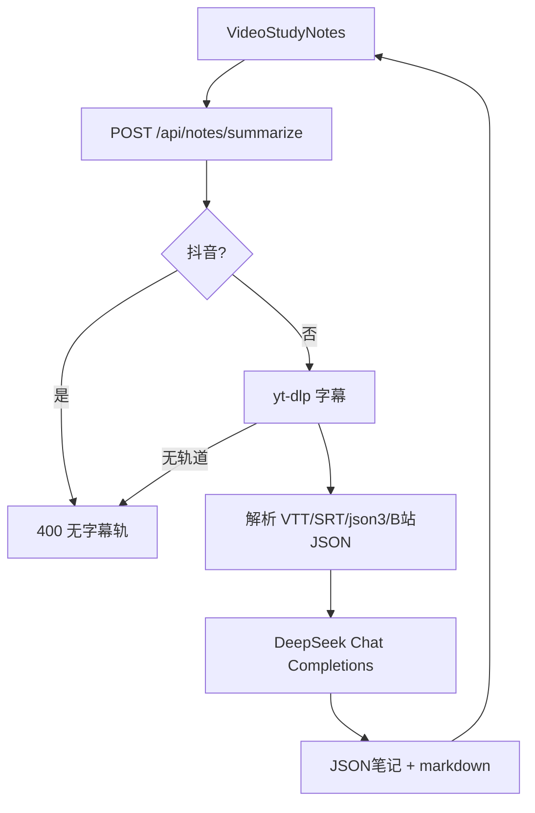

# AI 学习笔记：细化方案

> 竞品调研之后你选定「靠齐 NoteGPT 落地页」；随后五项确认已锁定。本文是**第一期的完整方案**（产品边界、管线、API、界面、验收）。实现总结仍看 [06-AI视频学习笔记.md](./06-AI视频学习笔记.md)。下载能力不在本文展开，见 [05](./05-视频下载功能总结.md)、[02](./02-技术方案.md)。

## 1. 已锁定决策

| 项 | 选择 |
|----|------|
| 产物 | 总览 + 带时间戳大纲 + 要点 + 字幕原文 + 树状脑图 |
| 无字幕 / 多数抖音 | **明确失败**，不做 ASR |
| 大模型 | DeepSeek，默认 `deepseek-flash` |
| 脑图 | 树状缩进，不做可拖拽画布 |
| 导出 | 复制 Markdown、`.md`、Word 能打开的 `.doc`（HTML 另存，非原生 docx） |
| 时间戳 | **只展示**，不跳播、不内嵌播放器 |
| 账号 / 配额 / 追问 | 第一期不做 |

差异化：同一页先看笔记再决定是否下载原片。竞品几乎不做这条闭环。

## 2. 用户路径

```text
粘贴公开链接
  → 解析成功（封面、标题、清晰度；下载区照旧）
  → 「生成学习笔记」（不必先下载整片）
  → Tab：大纲 / 要点 / 脑图 / 字幕
  → 复制 Markdown 或导出 .md / .doc
```

失败只影响笔记卡片：Key 未配、无字幕、模型超时。已解析结果和下载体留着。

## 3. 系统管线



文本只来自平台字幕（官方优先，否则自动字幕）。语言偏好：简中 → 繁中 → 英 → 其余第一条。

送给模型的字幕按 `SUMMARIZE_MAX_CHARS`（默认 48000）截断；接口里的 `transcript` 仍尽量给全量，方便对照。

## 4. DeepSeek 调用（以官网为准）

文档：[First API Call](https://api-docs.deepseek.com/)、[Chat Completions](https://api-docs.deepseek.com/api/create-chat-completion)、[JSON Output](https://api-docs.deepseek.com/guides/json_mode)、[Thinking](https://api-docs.deepseek.com/guides/thinking_mode)、[定价与模型](https://api-docs.deepseek.com/quick_start/pricing)。

| 项 | 取值 |
|----|------|
| 方法 | `POST https://api.deepseek.com/chat/completions` |
| 鉴权 | `Authorization: Bearer $DEEPSEEK_API_KEY` |
| 模型 | `deepseek-flash`（可改为 `deepseek-v4-pro`） |
| JSON Mode | `response_format: { "type": "json_object" }`，system prompt 必须出现 `json` |
| Thinking | `thinking: { "type": "disabled" }`（官网默认开启，结构化笔记关掉以免 CoT 拖超时） |
| 其它 | `stream: false`，`max_tokens` 默认 8192 |

本地：只在 `backend/.env` 写 `DEEPSEEK_API_KEY`（也认 `OPENAI_API_KEY`）。**不要**写进 `backend/.env.example`（该文件会进 Git）。上线用服务器环境变量注入，不要把 `.env` 打进镜像、前端包或公开仓库。健康检查只返回 `llm` 布尔值；模型错误不会把 Key 回传浏览器。未配置时笔记 503，**下载不受影响**。

## 5. API 契约

### 5.1 `GET /api/notes/ready`

```json
{ "llm": false, "llm_model": null }
```

下载健康检查仍是 `GET /api/health`（只含 `status` / `ffmpeg`），不混笔记字段。

### 5.2 `POST /api/notes/summarize`

请求：`{ "url": "..." }`（与解析同一套口令/链接规范化）。

成功 200 主要字段：

- `title`、`webpage_url`、`language`、`source`（`official` | `auto`）
- `overview`：2–4 句总览
- `outline[]`：`start`、`timestamp`、`title`、`summary`
- `key_points[]`
- `mind_map`：`{ label, children[] }` 递归
- `transcript[]`：`start`、`end`、`timestamp`、`text`
- `markdown`：前端直接复制/下载，后端不再二次排版文件

错误：

| HTTP | 何时 |
|------|------|
| 503 | 无 Key |
| 400 | 抖音、无字幕、字幕空/解析失败 |
| 502 | DeepSeek 超时、非 JSON、空 content、HTTP 4xx/5xx |

不新增数据库、不落笔记文件到 `downloads/`。

## 6. 模块与界面

| 模块 | 职责 |
|------|------|
| `services/captions.py` | 选轨、拉文件、解析 |
| `services/llm.py` | 组 URL/payload、调 DeepSeek、拆 JSON |
| `services/notes.py` | 规范大纲/脑图、拼 Markdown |
| `api/notes.py` | `ready` / `summarize` 编排 |
| `VideoStudyNotes.vue` | 生成、Tab、导出 |
| `MindMapTree.vue` | 递归树 |

界面挂在 `VideoResult` 下方，宽度仍 `max-w-search`。无 Key 时卡片上提示去填 `DEEPSEEK_API_KEY`。导出在浏览器用 `markdown` 生成 Blob，不另开下载接口。

## 7. 验收

- 单测：字幕解析、DeepSeek payload（JSON Mode + 关 thinking）、summarize mock、无 Key 为 503。
- 手工：配 Key 后，一条**有字幕**的 B 站或 YouTube 讲解走通四个 Tab 和导出；抖音或无字幕看到可读失败；下载仍可用。

## 8. 明确不做（第一期之后再开）

语音转写、点时间戳跳播/内嵌播放器、真正 docx/PDF 引擎、图形脑图、追问、登录配额、批量、画面理解、改写发公众号。

## 修订记录

| 日期 | 摘要 |
|------|------|
| 2026-09-25 | 按五项人工确认整理为独立细化方案 |
| 2026-09-25 | 密钥只放 backend/.env；example 禁止填真实值；错误回传脱敏 |
